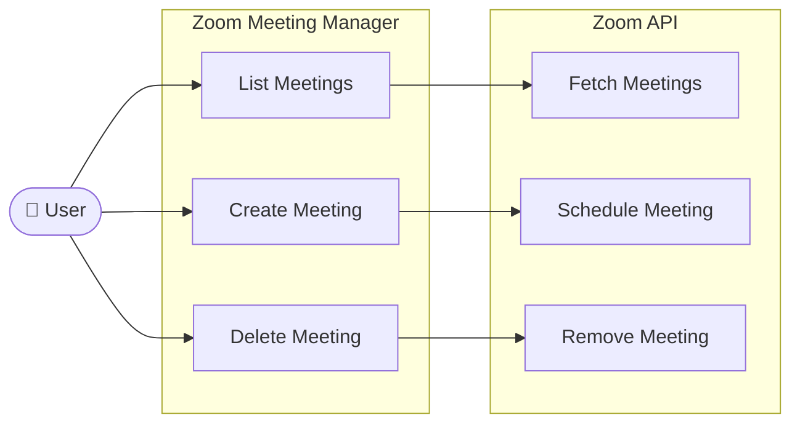
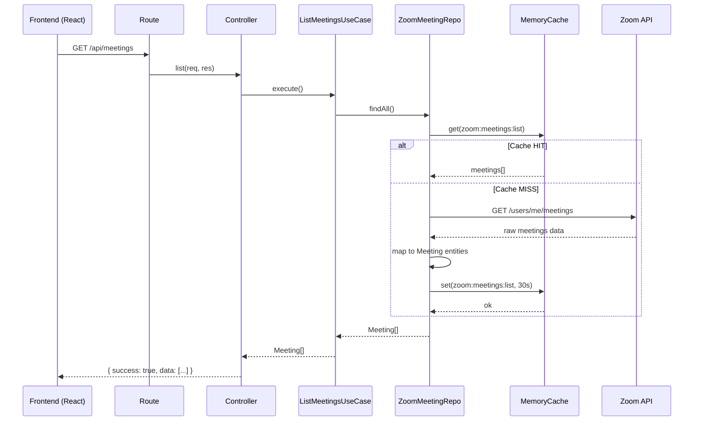
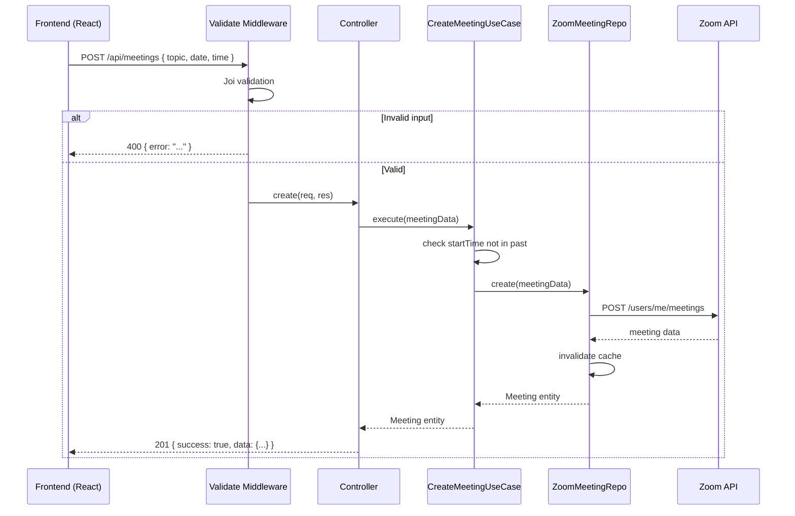
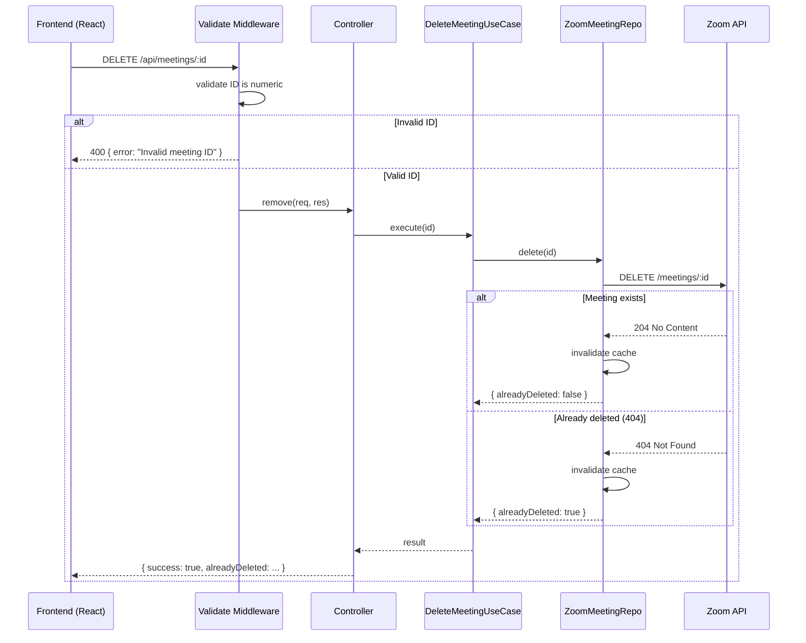
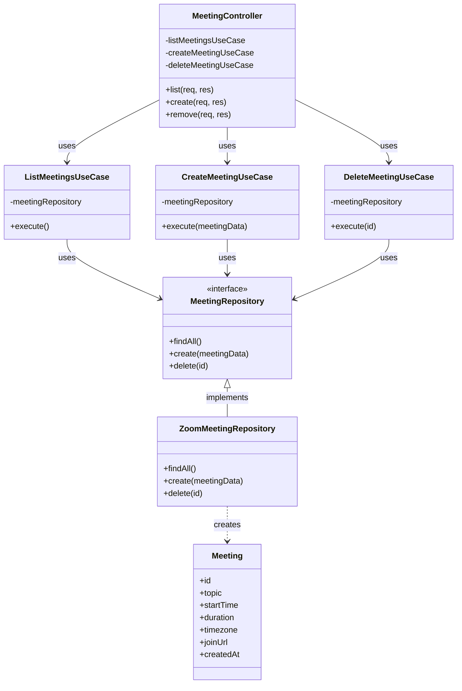

# Zoom Meeting Manager

A full-stack application to manage Zoom meetings — list, create, and delete — built with Node.js and React, following **Clean Architecture** principles.

---

## Tech Stack

**Backend:** Node.js · Express · Axios · Joi · Winston · express-rate-limit · helmet  
**Frontend:** React · Vite  
**Auth:** Zoom Server-to-Server OAuth

---

## Features

- List upcoming meetings from your Zoom account
- Create a new scheduled meeting (topic, date, time, duration)
- Delete a meeting with graceful handling if already deleted externally
- Auto-sync every 30 seconds with Zoom
- Request validation, rate limiting, caching, and structured logging

---

## Architecture

This project follows **Clean Architecture** — each layer has one responsibility and the inner layers never depend on the outer layers.

```
        ┌──────────────────────────────┐
        │       Infrastructure         │  Zoom API, Cache
        │   ┌──────────────────────┐   │
        │   │     Presentation     │   │  Controllers, Routes
        │   │   ┌──────────────┐   │   │
        │   │   │  Use Cases   │   │   │  Business Logic
        │   │   │  ┌────────┐  │   │   │
        │   │   │  │Entities│  │   │   │  Core Data
        │   │   │  └────────┘  │   │   │
        │   │   └──────────────┘   │   │
        │   └──────────────────────┘   │
        └──────────────────────────────┘
```

---

## Project Structure

```
server/src/
├── entities/                         # Core data — Meeting class
├── interfaces/                       # Contracts — MeetingRepository
├── use-cases/                        # Business logic
│   ├── listMeetings.js
│   ├── createMeeting.js
│   └── deleteMeeting.js
├── infrastructure/
│   ├── zoom/                         # Zoom API integration
│   │   ├── zoomClient.js             # Token management + axios
│   │   └── zoomMeetingRepo.js        # Implements MeetingRepository
│   └── cache/
│       └── memoryCache.js
├── presentation/
│   ├── controllers/
│   │   └── meetingController.js
│   ├── routes/
│   │   └── meetings.js
│   └── middleware/
│       ├── validate.js               # Joi validation
│       └── errorHandler.js
├── config/
├── utils/
│   ├── logger.js                     # Winston
│   └── asyncHandler.js
└── app.js                            # Dependency Injection + Express setup
```

---

## Diagrams

### Use Case Diagram



---

### Sequence Diagram — List Meetings



---

### Sequence Diagram — Create Meeting



---

### Sequence Diagram — Delete Meeting



---

### Class Diagram



---

## Prerequisites

- Node.js v18+
- A Zoom account — [zoom.us](https://zoom.us)

---

## Zoom App Setup

1. Go to [marketplace.zoom.us](https://marketplace.zoom.us) → **Develop → Build App**
2. Choose **Server-to-Server OAuth** → Create
3. Under **Scopes**, add:
   - `meeting:read:list_meetings:master`
   - `meeting:write:meeting:master`
   - `meeting:delete:meeting:master`
4. Click **Activate**
5. Copy your `Account ID`, `Client ID`, and `Client Secret`

---

## Getting Started

### 1. Configure environment

```bash
cd server
cp .env.example .env
```

Fill in your Zoom credentials in `.env`:

```env
ZOOM_ACCOUNT_ID=your_account_id
ZOOM_CLIENT_ID=your_client_id
ZOOM_CLIENT_SECRET=your_client_secret
```

### 2. Install dependencies

```bash
# Backend
cd server && npm install

# Frontend
cd ../client && npm install
```

### 3. Run the app

Open two terminals:

```bash
# Terminal 1 — Backend (http://localhost:3001)
cd server && npm run dev

# Terminal 2 — Frontend (http://localhost:5173)
cd client && npm run dev
```

---

## API Reference

| Method | Endpoint | Description |
|--------|----------|-------------|
| `GET` | `/api/meetings` | List upcoming meetings |
| `POST` | `/api/meetings` | Create a meeting |
| `DELETE` | `/api/meetings/:id` | Delete a meeting |
| `GET` | `/health` | Server health check |

**POST `/api/meetings` body:**
```json
{
  "topic": "Sprint Planning",
  "date": "2026-04-01",
  "time": "10:00",
  "duration": 60
}
```

---

## Environment Variables

| Variable | Description | Default |
|----------|-------------|---------|
| `ZOOM_ACCOUNT_ID` | Zoom account ID | required |
| `ZOOM_CLIENT_ID` | Zoom client ID | required |
| `ZOOM_CLIENT_SECRET` | Zoom client secret | required |
| `PORT` | Server port | `3001` |
| `NODE_ENV` | Environment | `development` |
| `CLIENT_URL` | Frontend URL for CORS | `http://localhost:5173` |

---

## Common Issues

**Missing environment variables** → Make sure `.env` exists in `/server` with all 3 Zoom values.

**401 Unauthorized** → Confirm your Zoom app is **Activated**, not just created.

**403 Forbidden** → Check that all 3 scopes are added in the Zoom app settings.

**Frontend can't connect** → Make sure the backend is running on port 3001 first.